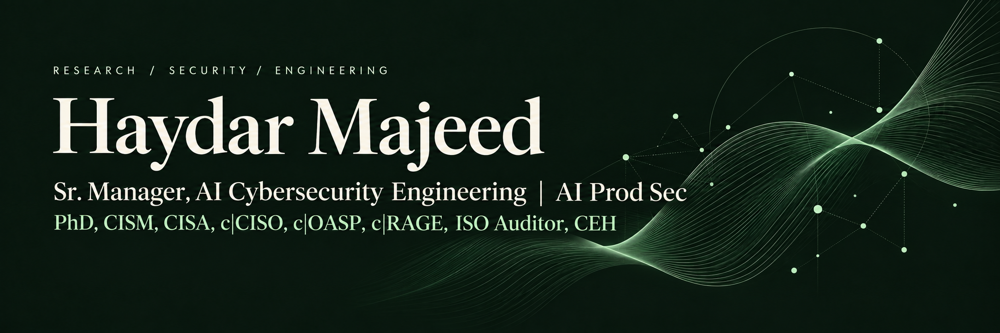

  

<h1 align="center">AI security leader. Researcher. Builder.</h1>

<code>AI SECURITY</code> · <code>AI-NATIVE ENGINEERING</code> · <code>RESPONSIBLE INNOVATION</code>

  <strong>AI Security &amp; Strategy · Dexcom R&amp;D</strong> 
  PhD · Cybersecurity engineering &amp; education · San Diego, California

  <a href="#what-i-do">Focus</a> &nbsp; / &nbsp;
  <a href="#from-research-to-prototype">Prototypes</a> &nbsp; / &nbsp;
  <a href="#tools--technical-practice">Toolbox</a> &nbsp; / &nbsp;
  <a href="#public-work">Public work</a> &nbsp; / &nbsp;
  <a href="#connect--learn">Connect</a>

## Research with intent. Engineering with evidence.

I work where **artificial intelligence, cybersecurity, and product engineering** meet. My focus is turning promising ideas into useful systems—with security, evidence, and human accountability built in.

My background spans hands-on cybersecurity engineering, product security leadership, and teaching. Today, I connect AI security research with responsible adoption and AI-native development.

## What I do

| Practice | The question I work on |
| :--- | :--- |
| **AI security & red teaming** | How do intelligent systems fail, and which safeguards actually help? |
| **AI-native engineering** | How can AI improve the full development lifecycle—from requirements to release? |
| **Responsible innovation** | How do we move quickly while preserving human judgment, evidence, and accountability? |

## From research to prototype

Three areas where I have **built, tested, and demonstrated prototypes**:

<table>
  <tr><td><strong>01 / AI Red Teaming</strong> Exploring AI security testing through a working prototype.</td></tr>
  <tr><td><strong>02 / Agentic Threat Modeling</strong> Exploring how agentic AI can support threat modeling.</td></tr>
  <tr><td><strong>03 / Agentic Penetration Testing</strong> Exploring AI-assisted security testing through a prototype demonstration.</td></tr>
</table>

Prototype demonstrations, not production-deployment claims. Public case studies will be linked when available; internal code and findings remain private.

> **My approach:** make the idea tangible, test the assumptions, preserve the evidence, and keep consequential decisions with people.

## Tools & technical practice

**AI & agentic workflows**

  
  
  
  

**Portfolio engineering**

  
  
  
  
  

Selected tools from my work and portfolio—not an exhaustive skills list or a vendor endorsement.

## Research & professional foundation

**PhD** · AI and cybersecurity research · Engineering and education

`CISM` · `CISA` · `c|CISO` · `CEH`

More credentials & research interests

**Additional credentials:** c|OASP · c|RAGE · ISO 27001 Lead Auditor · Security+

**Research interests:** adversarial AI, trustworthy agentic systems, AI-native software development, and evidence-led security engineering.

Credentials above are professional background; these visual labels are not live certification-verification links.

## Public work

| Repository | Context |
| :--- | :--- |
| [**Cloudflare_computer ↗**](https://github.com/hmdex/Cloudflare_computer) | My public fork of [cloudflare/computer](https://github.com/cloudflare/computer), an agent-computer project. Credit belongs to the upstream authors. |
| [**This profile ↗**](https://github.com/hmdex/hmdex) | The README and visual assets behind this page. |

This is a public selection, not an inventory of my professional work. Explore the current [public repositories](https://github.com/hmdex?tab=repositories); private work stays private.

## Connect & learn

Interested in **AI security, responsible agentic systems, research, or engineering collaboration**? Find me on [GitHub](https://github.com/hmdex).

**Website:** link pending · **LinkedIn:** link pending · **YouTube:** link pending

---

<strong>Ambitious ideas. Responsible systems.</strong> Personal professional profile. Views are my own; no employer endorsement is implied.

